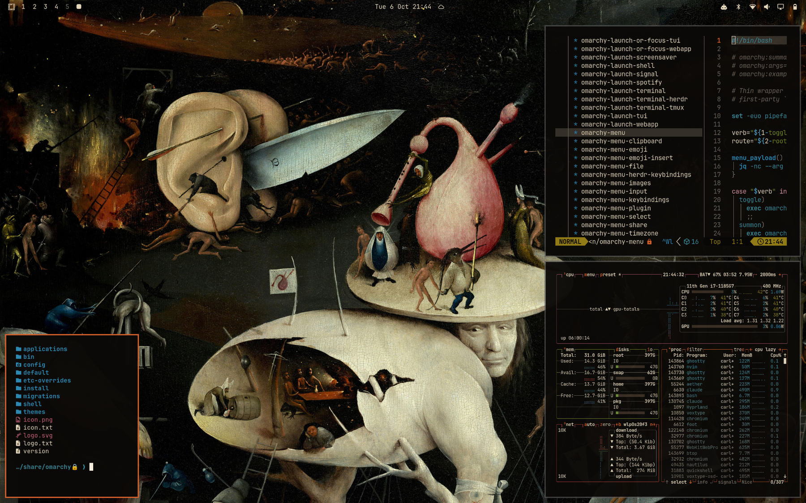
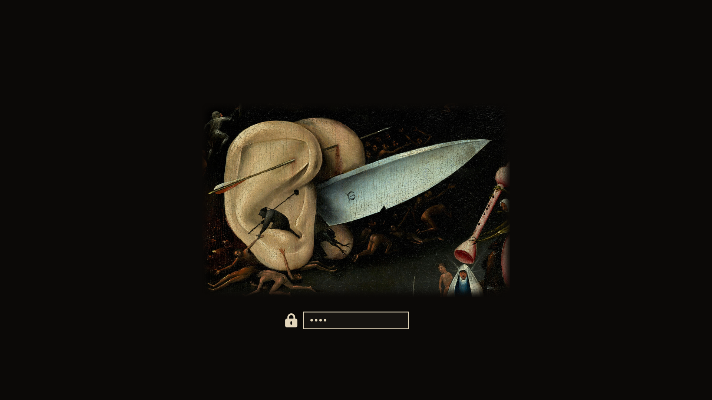

# El jardín de las delicias (oscuro) — tema para Omarchy



Yo, Dalí, os lo advierto: cerrad el tríptico y entraréis en la noche más luminosa de la historia de la pintura. El Bosco incendió una ciudad entera para iluminar su Infierno, y en esa luz de brasa todo es música y castigo. ¡Dos orejas gigantes avanzan atravesadas por un cuchillo, como un tanque de carne! ¡Un hombre árbol os mira por encima del hombro con la melancolía del que ya lo ha visto todo! ¡Arpas, laúdes y zanfonas convertidos en instrumentos de tortura! Ni yo me atreví a tanto.

Este tema es la tabla derecha del tríptico, el Infierno. El negro de la noche infernal es ahora vuestro fondo; el naranja de los incendios, vuestro acento; el amarillo del arpa, el azul del príncipe con cabeza de pájaro y el rosa de la gaita, vuestros colores. Programad sin miedo: aquí el único pecado es el código sin comentar.

*Texto escrito a la manera de Salvador Dalí, admirador de El Bosco. No es una cita suya.*

Un tema oscuro para [Omarchy](https://omarchy.org) basado en *El jardín de las delicias* de El Bosco, Museo del Prado. Todos los colores están ajustados para leerse con buen contraste sobre cualquiera de los tonos de fondo (WCAG 5:1).

Su pareja clara, sacada del Paraíso y del Jardín: [El jardín de las delicias (claro)](https://github.com/carloschida/omarchy-jardin-de-las-delicias-claro-theme).

## Instalación

```bash
omarchy theme install https://github.com/carloschida/omarchy-jardin-de-las-delicias-oscuro-theme
```

Después, elígelo en el selector de temas o ejecuta `omarchy theme set jardin-de-las-delicias-oscuro`.

## Fondos de pantalla

Cinco encuadres del Infierno (tabla derecha) en 4K (3840 × 2400), recortados del escaneo en alta resolución del Bosch Research and Conservation Project:

1. La ciudad en llamas
2. Las orejas y el cuchillo
3. El hombre árbol
4. El infierno musical
5. Los jugadores

Los fondos son 16:10 y están compuestos para que nada importante se pierda en pantallas 16:9. Cambia de fondo con `omarchy theme bg next`.

## Extras

- **Pantalla de desbloqueo** (`unlock.png`): las orejas atravesadas por el cuchillo. Actívala con `omarchy plymouth set by theme jardin-de-las-delicias-oscuro`.
- **Teclado RGB** (`keyboard.rgb`): el naranja de los incendios, para portátiles compatibles.



## Créditos y licencia

*El jardín de las delicias*, El Bosco, hacia 1490–1500. Óleo sobre tabla de roble. Museo del Prado, Madrid.
Imágenes a partir del escaneo del [Bosch Research and Conservation Project](https://commons.wikimedia.org/wiki/File:The_Garden_of_earthly_delights.jpg) publicado en Wikimedia Commons. La obra y sus reproducciones fieles son de **dominio público**.

Los archivos del tema (colores, configuración y este README) se publican bajo la [licencia MIT](LICENSE). Las imágenes no están sujetas a esa licencia: son de dominio público.
